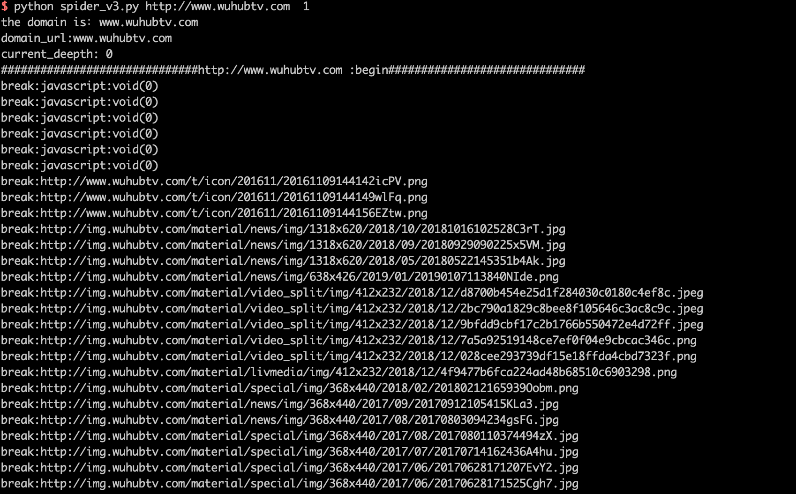
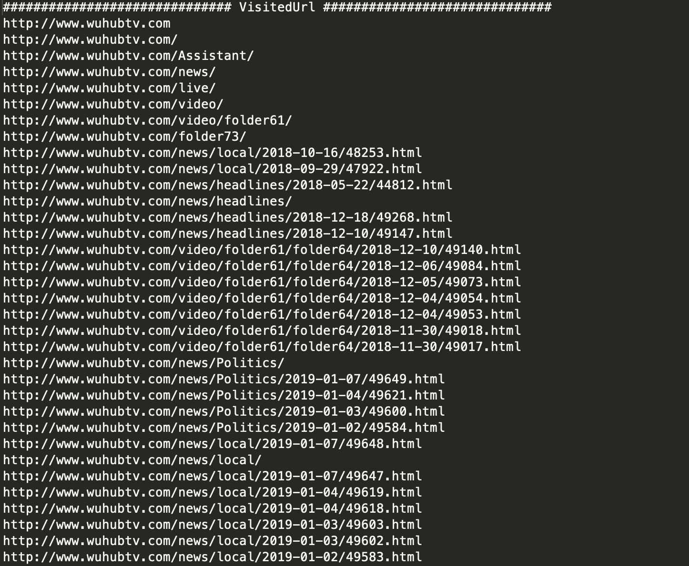
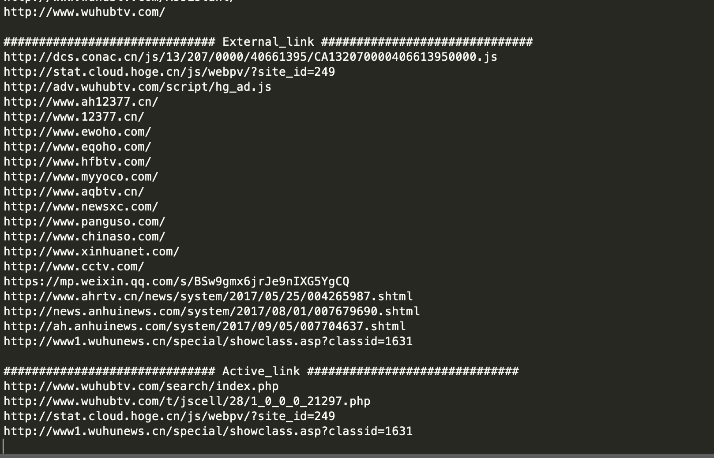

# Common_Spider

一个还算通用的爬虫脚本，可自己设定爬取的深度，可以把网站的动态链接地址和外链单独分出来，做安全测试时可以提前爬一下页面，避免测试时会有遗漏。


# Change Log

- [2018-07-05] 对爬取时遇到的一些异常进行了优化
- [2018-04-03] 对域名的处理进行了完善
  
# Usage

使用比较简单：

安装requests依赖

```
pip install requests
```

运行爬虫

```
 python2 spider_v3.py  url  5   --> url为待爬取的网站地址，5为爬取深度，可以不设，默认为5。
```


# Screenshot

- 扫描过程



- 扫描结果



- 外链和动态链接

